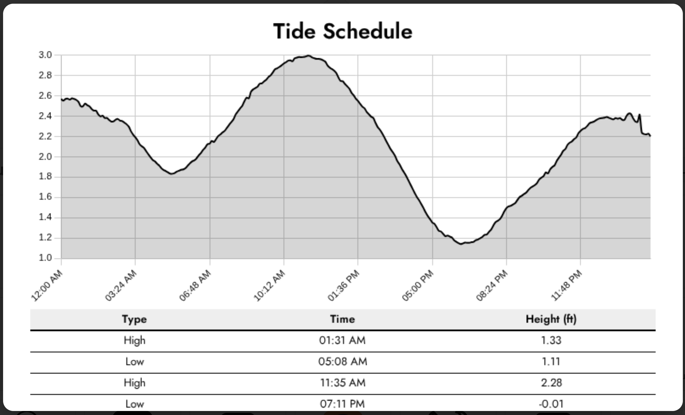
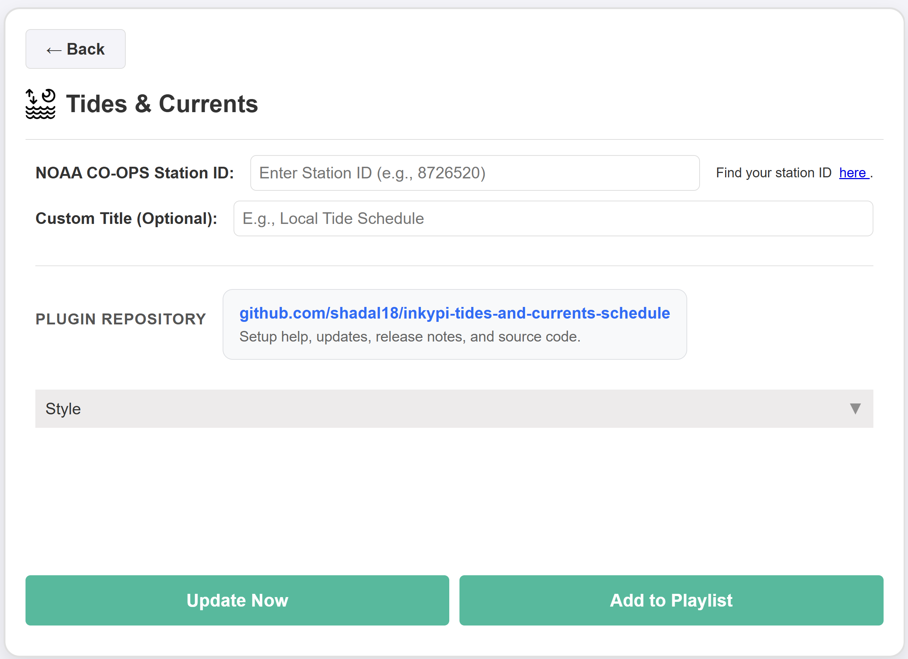

# InkyPi Tides and Currents Schedule

A custom InkyPi plugin that shows NOAA tide schedule data with a clean, glanceable layout, a tide graph, and configurable station-based output.

## Install

Use the InkyPi plugin installer with the plugin ID and this repository URL, following the install pattern used by InkyPi plugins.

```bash
inkypi plugin install tides_and_currents_schedule https://github.com/shadal18/inkypi-tides-and-currents-schedule
```

## Update

To update the plugin on your InkyPi device:

1. SSH into your InkyPi host.
2. Change into the plugin directory:
   ```bash
   cd ~/InkyPi/src/plugins/tides_and_currents_schedule
   ```
3. Run this update command:
   ```bash
   git pull origin main && \
   if [ -d tides_and_currents_schedule ]; then \
     shopt -s dotglob nullglob && \
     mv tides_and_currents_schedule/* . && \
     rmdir tides_and_currents_schedule; \
   fi && \
   sudo systemctl restart inkypi.service
   ```

If you don’t see your changes after updating:

- Confirm you are in the correct plugin folder.
- Clear your browser cache or hard refresh the InkyPi web UI.
- Check the InkyPi logs for any plugin errors.

## Requirements

- A valid NOAA CO-OPS station ID.
- Network access from the InkyPi device to NOAA Tides & Currents.

## Features

This plugin is an extension for the InkyPi e-paper display frame and includes the following features.

- Shows daily tide schedule data for a selected NOAA station.
- Displays high and low tide times with tide height values.
- Shows a water-level graph for quick visual reference.
- Supports a custom title.
- Supports NOAA station-based configuration.
- Uses NOAA Tides & Currents data as the source.

## Settings

The plugin settings page lets you customize:

- NOAA CO-OPS station ID.
- Custom title.

## Station ID

This plugin requires a NOAA CO-OPS station ID.

To find your station ID:

1. Go to [https://tidesandcurrents.noaa.gov/map/](https://tidesandcurrents.noaa.gov/map/).
2. Find the station closest to your area.
3. Open the station page.
4. Copy the station ID.

You can also use a direct NOAA station page, where the station ID is shown in the page title and station details.

## Repository

GitHub repository:

[https://github.com/shadal18/inkypi-tides-and-currents-schedule](https://github.com/shadal18/inkypi-tides-and-currents-schedule)

## Screenshots

- Main plugin display showing tide schedule and graph.
- Plugin settings screen.

<p align="center">
  
  
</p>
